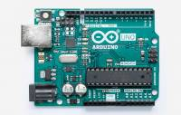

# 0113-MyoCoach-DIY : Firmware Programming Manual

The Arduino board fulfils two roles:

* acquiring the signals from the EMG sensors on two analogue inputs
* sending this data to a computer via the USB port by emulating a serial link.

The source code of the Arduino program is available in [src/software/firmware](../src/software/firmware)

At Orthopus, we use the online programming tool developed by Arduino. You can find help and information about this tool by following this link:
[Getting Started with Arduino Web Editor](https://create.arduino.cc/projecthub/Arduino_Genuino/getting-started-with-arduino-web-editor-on-various-platforms-4b3e4a?f=1)

## Programmation

* :one: Create an account on the online programming tool developed by Arduino: [Arduino Web Editor](https://create.arduino.cc)

* :two: Install the Arduino Web Editor [plugin](https://create.arduino.cc/getting-started/plugin)

> :bulb: At ORTHOPUS we use the Arduino Web Editor but it is also possible to use and install the Arduino IDE to program the board.

* :three: Importing the **myocoach.ino** file into the online code editor

* :four: Connecting the Arduino card to the computer
* :five: Transfer the MyoCoach programme to the Arduino card
