# 0113-MyoCoach-DIY : User Manual

---

The MyoCoach with USB connection is intended for health care professional and users of upper limb prostheses. Its functionalities allow to :

* Measure muscle potential using myoelectric sensors
* Defining the optimum electrode position
* Adjusting the myoelectric electrodes
* Exercise in muscle contraction and coordination

## Prerequisites and functionalities
 * 1 Computer with the MyoCoach application
 * 1 MyoCoach box :one:
 * 1 USB cable (Arduino) :two:
 * 2 Ottobock electrodes (Ref 13E202) :three:
 * 2 Electrode cables :four:
 * 2 Electrode holders :five:
 * 1 Velcro strap :six:
 * 1 Flat screwdriver :seven:
 * 1 pencil (watercolour type)

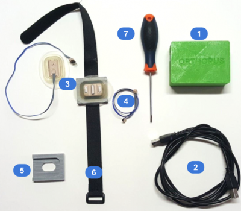

The application and the MyoCoach box allow the user to test his ability to control a myoelectric prosthesis. These tests are carried out on a computer and are close to real-life conditions.

The video game integrated into the application allows fun muscle training. In addition, it accelerates the learning of the dissociation of the different muscle groups.

Two 13E202 electrodes connected to the MyoCoach box receive the user's myoelectric muscle signals. These are then sent to the computer to be visualised in the form of a gauge or in the form of a graph (Widget Signal).

The MyoCoach is switched on by plugging the box into the USB port of the computer. Then the user must connect the MyoCoach application to the box (Arduino board).

To switch off the MyoCoach, simply disconnect the USB plug from the computer.

## safety instructions
> :warning: Make sure that no solid or liquid particles can get inside the housing.

> :warning: Do not expose the unit to intensive fumes or dust, mechanical vibrations, shocks or excessive temperatures.

> :warning: Avoid using the MyoCoach near sources of major electrical and magnetic interference (transformers or transmitters for example).

> :warning: Respect pauses during use, as muscular fatigue produces irregular results which can lead to the electrodes being adjusted too sensitively.

> :warning: Make sure that the contact surface of the electrodes is applied to healthy skin. If significant malfunctions are detected, the position of the electrodes should be checked and modified if necessary. Refer to the paragraph on electrode placement for more information.

> :warning: The use of a battery charger on the laptop will in most cases interfere with the operation of the electrodes, i.e. the value without any electrode activity is not zero. It is recommended to disconnect the mains power supply during myoelectric data recording and to run the laptop on battery power.

## Application overview
To launch the MyoCoach application, refer to the [ui-programming-manual](./ui-programming-manual.md) in the section : **launch the application**

Here is a description of the MyoCoach interface.

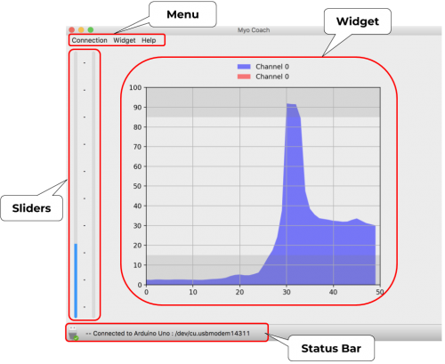

### Menu : Connection
This Menu allows you to establish the connection with the Arduino board in order to start the acquisition of EMG signals to the application.

* :one: Click on the **Connection** Menu, the card name and its port should be displayed.

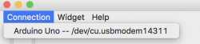
* :two: Click on the name of the Arduino board.
* :three: If the connection is effective, the information will be present in the **status bar** at the bottom of the application.

> :bulb: If during the use of the MyoCoach application, you encounter a problem (absence of EMG signals, blocking of the menus...), remember to check in the status bar if the connection with the Arduino board is still active.

### Menu : Widget
In this menu you can choose between the different Widgets.
* **Signal**: Displays the EMG signals in raw form.
* **Game**: lists the games available in the MyoCoach.

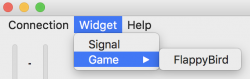

### Menu: Help
In this menu you will find two submenus
* **About**: gives information about the version of the code, a link to the ORTHOPUS website and a reminder of the Open Source license of the code.
* **User Manual**: is a shortcut to this user manual page. It's Magic! :zap:

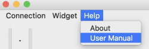

### Sliders
Whatever the choice of widget, the sliders are always visible on the right side of the application. They allow you to see and evaluate EMG signals in real time.

* The signal from the sensor connected to  **EMG 0** input of the box is the slider on the **left**. It changes from [0 to 100%] from **bottom to top** because this sensor, positioned **outside** the arm, controls the **closure** of the prosthesis.
* The signal from the sensor connected to the **EMG 1** input of the box is the **right** slider. It changes from [0 to 100%] **up and down** as the sensor on the inside of the arm controls the **opening** of the prosthesis.

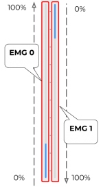

## Electrodes placement protocol
The primary function of the MyoCoach is to optimise electrode placement and find the right gain setting.

For this protocol, we use Ottobock electrodes (Ref 13E202).

This protocol is the result of a scientific publication from the University of Salford (UK).

> :bulb: Chadwell Alix, Kenney Laurence, Thies Sibylle, Galpin Adam, Head John (2016) The Reality of Myoelectric Prostheses: Understanding What Makes These Devices Difficult for Some Users to Control [url](https://www.frontiersin.org/articles/10.3389/fnbot.2016.00007/full)

This test protocol allows the placement of two electrodes which are useful for the use of a myoelectric prosthesis. We use two groups of wrist muscles to control the prosthesis:

* the **flexor muscles** of the wrist to **close the hand** of the prosthesis (1)
* the **extensor muscles** of the wrist to **open the hand** of the prosthesis (2)

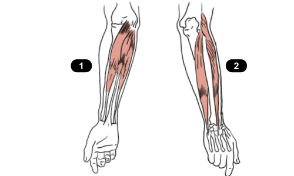

* :one: Equip an electrode with a pin header strip to make an adapter with the MyoCoach connector system (see the electrode connector section in the [manufacturing-manual](./manufacturing-manual.md)).

* :two: Adjust the electrode gain to a medium level between 3-4

To access the gain adjustment potentiometer of the Ottobock 13E202 sensor, it is not necessary to remove the sensor from the armband! Simply move it as shown below.

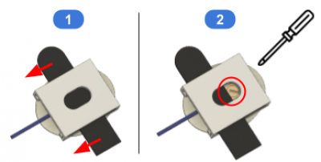

* :three: Connect this electrode to the EMG 0 connector of the MyoCoach housing.

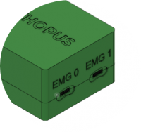

* :four: Connect the MyoCoach box to the computer using the USB cable supplied with the Arduino card.

* :five: Launch the MyoCoach application on the computer, connect the application to the Arduino card and choose the Signal Widget.
* :six: Hold the electrode on the user's muscle.

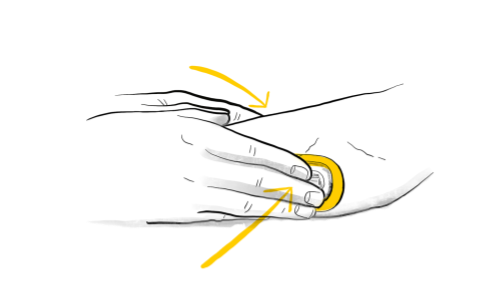

An EMG electrode must be placed along and in the middle of the muscle fibre.

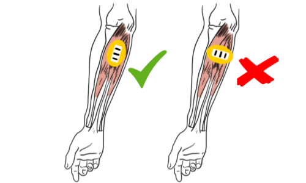

* :seven: 7 Ask the user to repeatedly and regularly contract the muscle concerned by the electrode at a comfortable level, without too much muscle intensity. Note the level of the signal obtained.

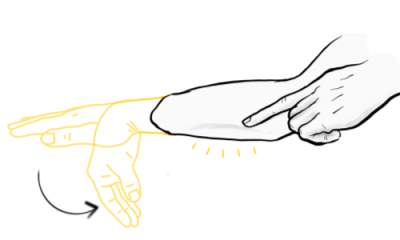

* :eight: Then move the electrode in the 4 directions (up, down, left and right) from the starting position. The movement should be about half the width of the electrode (1 cm).

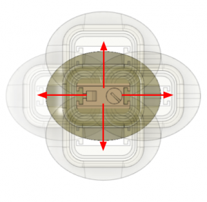

* :nine: If the signal amplitude is greater at one of the new positions, repeat step :eight:, defining this new position as the starting point.

* :keycap_ten: The position with the maximum amplitude is then marked on the user's skin with a **pencil**.

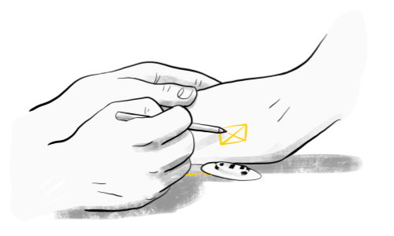

* Finally, the gain adjustment is defined so that the user can comfortably reach a signal level between 20 and 80% on the application's Signal Widget.

> :bulb: This protocol must be repeated for the second electrode.

### Connect Electrode to the box :

:one: Assemble the two electrodes on the armband. The armband offers several degrees of freedom to allow the electrodes to be positioned optimally on the user's arm. (See the section ArmBand: Adjustments and positioning in the [manufacturing-manual](./manufacturing-manual.md)).

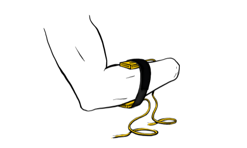

:two: Connect the electrodes to the MyoCoach housing.
* The electrode on the **outside** of the forearm must be connected to the **EMG 0** connector of the housing.
* The electrode placed **inside** the forearm must be connected to the **EMG 1** connector of the housing.

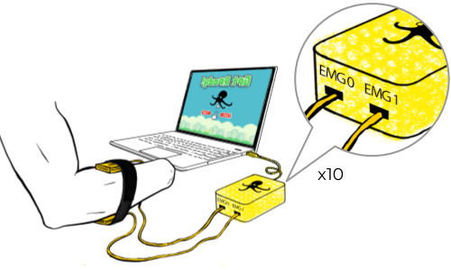

Once the electrodes have been connected and the ArmBand adjusted, the user is ready to practice using EMG sensors! :muscle:

## Using the application
This v1.0 of the application includes the minimum functionality to correctly place EMG electrodes on a user with the **Widget:Signal** and to train and improve the user's muscle coordination with the game in the **Widget:FlappyBird**.

### Widget: Signal
This widget allows the visualisation of EMG signals on a scale from 0 to 100%. It is mainly used in the **electrode placement protocol**.

### Widget: FlappyBird
This widget allows the user to improve his muscular coordination in a fun way. The game is inspired by the Open Source game :link:[Flappy Bird](https://github.com/sourabhv/FlapPyBird).

The game play has been modified to better correspond to the use of EMG sensors but the graphics of the original game have been kept! :fire:

* The bird does not fall. It maintains its height when the user does not control it
* A pulse from the **EMG 0** sensor moves the bird **upwards**.
* A pulse from the **EMG 1** sensor moves the bird **downwards**.
* The displacement of the bird is relative to the power of the pulse.
* The scrolling speed of the stage increases every ten points.
* Use the computer **keyboard Space** ⌨️ to start or restart the game.

Record by Bionico :boom:
