# 0113-MyoCoach-DIY : User Manual

---

The MyoCoach system is intended for health care professional and users of upper limb prostheses. Its features allow to :

* Measure muscle potential using myoelectric sensors
* Defining the optimum electrode position
* Adjusting the myoelectric electrodes
* Exercise in muscle contraction and coordination

## Prerequisites and features
 * 1 Personal Computer with a Wi-Fi network interface (or smartphone/tablet) with a web browser
 * 1 MyoCoach box :one:
 * 1 USB cable (Arduino) :two:
 * 2 Ottobock electrodes (Ref 13E202) :three:
 * 2 Electrode cables :four:
 * 2 Electrode holders :five:
 * 1 Velcro strap :six:
 * 1 Flat screwdriver :seven:
 * 1 pencil (watercolour type)

_!TODO: IMAGE UPDATE REQUIRED!_

The application and the MyoCoach box allow the user to test his ability to control a myoelectric prosthesis. These tests are carried out on a computer and are close to real-life conditions.

The interactive exercises and the video game integrated into the application allows fun muscle training. In addition, it accelerates the learning of the dissociation of the different muscle groups.

Two 13E202 electrodes connected to the MyoCoach box receive the user's myoelectric muscle signals. These signals are then sent to the connected devices to be displayed in a web browser.

The MyoCoach is switched on by plugging in the box power supply to a USB charger or the USB port of a PC. Then the user must connect his device (PC, smartphone or tablet) to the MyoCoach Wi-Fi network.

To switch off the MyoCoach, go to the "Settings" section of the web application and hit the "Shutdown" button. Or if the MyoCoach is equipped with an LED power button (optional) simply push-it.

## Safety instructions
> :warning: Make sure that no solid or liquid particles can get inside the housing.

> :warning: Do not expose the unit to intensive fumes or dust, mechanical vibrations, shocks or excessive temperatures.

> :warning: Avoid using the MyoCoach near sources of major electrical and magnetic interference (transformers or transmitters for example).

> :warning: Respect pauses during use, as muscular fatigue produces irregular results which can lead to the electrodes being adjusted too sensitively.

> :warning: Make sure that the contact surface of the electrodes is applied to healthy skin. If significant malfunctions are detected, the position of the electrodes should be checked and modified if necessary. Refer to the paragraph on electrode placement for more information.

> :warning: The use of a battery charger on the laptop will in most cases interfere with the operation of the electrodes, i.e. the value without any electrode activity is not zero. It is recommended to disconnect the mains power supply during myoelectric data recording and to run the laptop on battery power.

## Electrodes placement protocol
The primary function of the MyoCoach is to optimise electrode placement and find the right gain setting.

For this protocol, we use Ottobock electrodes (Ref 13E202).

This protocol is the result of a scientific publication from the University of Salford (UK).

> :bulb: Chadwell Alix, Kenney Laurence, Thies Sibylle, Galpin Adam, Head John (2016) The Reality of Myoelectric Prostheses: Understanding What Makes These Devices Difficult for Some Users to Control [url](https://www.frontiersin.org/articles/10.3389/fnbot.2016.00007/full)

This test protocol allows the placement of two electrodes which are useful for the use of a myoelectric prosthesis. We use two groups of wrist muscles to control the prosthesis:

* the **flexor muscles** of the wrist to **close the hand** of the prosthesis (1)
* the **extensor muscles** of the wrist to **open the hand** of the prosthesis (2)

* :one: - Equip an electrode with a pin header strip to make an adapter with the MyoCoach connector system (see the electrode connector section in the [manufacturing-manual](./manufacturing-manual.md)).

* :two: - Adjust the electrode gain to a medium level between 3-4

To access the gain adjustment potentiometer of the Ottobock 13E202 sensor, it is not necessary to remove the sensor from the armband! Simply move it as shown below.

* :three: - Connect this electrode to the EMG 0 connector of the MyoCoach housing.

* :four: - Connect the MyoCoach box to the computer using the USB cable supplied with the Arduino card.

* :five: - Launch the MyoCoach application on the computer, connect the application to the Arduino card and choose the Signal Widget.
* :six: - Hold the electrode on the user's muscle.

An EMG electrode must be placed along and in the middle of the muscle fibre.

* :seven: - Ask the user to repeatedly and regularly contract the muscle concerned by the electrode at a comfortable level, without too much muscle intensity. Note the level of the signal obtained.

* :eight: - Then move the electrode in the 4 directions (up, down, left and right) from the starting position. The movement should be about half the width of the electrode (1 cm).

* :nine: - If the signal amplitude is greater at one of the new positions, repeat step :eight:, defining this new position as the starting point.

* :keycap_ten: - The position with the maximum amplitude is then marked on the user's skin with a **pencil**.

* Finally, the gain adjustment is defined so that the user can comfortably reach a signal level between 20 and 80% on the application's Signal Widget.

> :bulb: This protocol must be repeated for the second electrode.

### Connect Electrode to the box

:one: - Assemble the two electrodes on the armband. The armband offers several degrees of freedom to allow the electrodes to be positioned optimally on the user's arm. (See the section ArmBand: Adjustments and positioning in the [manufacturing-manual](./manufacturing-manual.md)).

:two: - Connect the electrodes to the MyoCoach housing.
* The electrode on the **outside** of the forearm must be connected to the **EMG 0** connector of the housing.
* The electrode placed **inside** the forearm must be connected to the **EMG 1** connector of the housing.

Once the electrodes have been connected and the ArmBand adjusted, the user is ready to practice using EMG sensors! :muscle:

## Application overview

The MyoCoach web application is hosted on a Raspberry Pi computer. The Raspberry Pi is set as a Wi-Fi access point and the application can be accessed by connected clients using a web browser.

For full feature support and a good user experience, we recommend to use of one of the following web browsers  :

* Firefox Browser (ver. 93)
* Google Chrome/Chromium (ver. 88)

### Getting started

* :one: - Connect the Raspberry Pi with a USB cable. If equipped, the LED button will light up in white.
* :two: - Wait until the MyoCoach is ready to use. If equipped, the LED button color must change to blue when the system is ready.
* :three: - Connect your client device (PC, phone or tablet) to the MyoCoach network by Wi-Fi. The credentials can be :
   * previously configured with the INSTALL-en document
   * previously configured by Orthopus - SSID = myocoach-01, secret = null (no passphrase)
   * not configured, default value - SSID = raspi-webgui, secret = ChangeMe
* :four: - A captive portal shows up automatically :

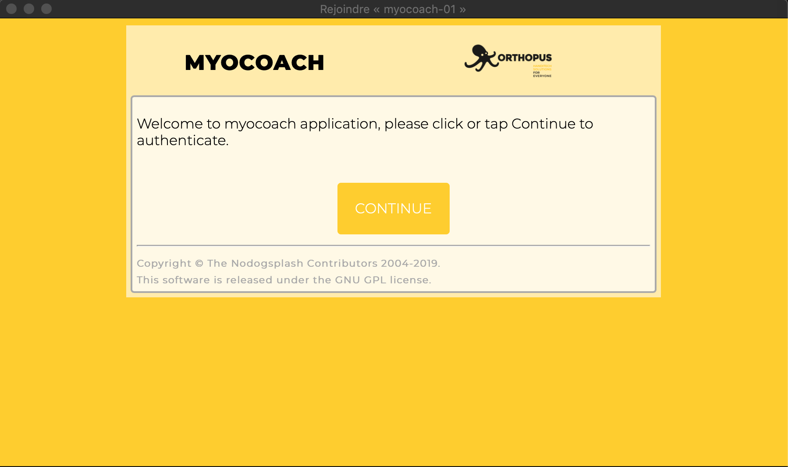

Click or tap on Continue to authenticate.

* :five: - A new page shows up with the link to access the web application :

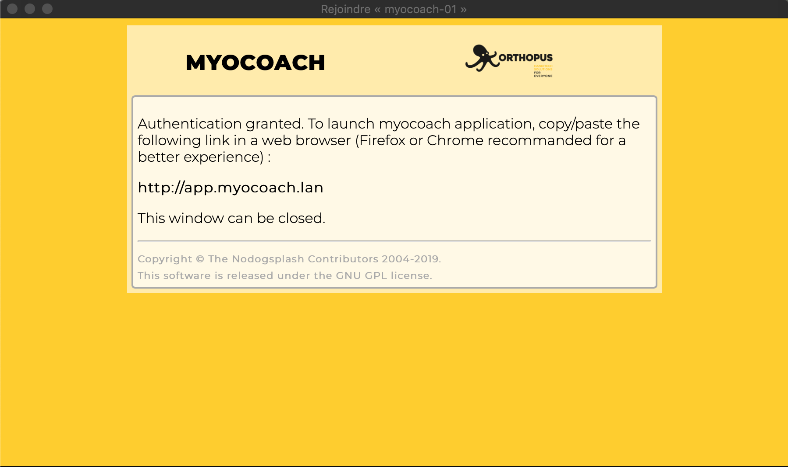

Copy then paste the link in a web browser. The captive portal window can now be closed.

* :six: - The MyoCoach web application starts with the following section :

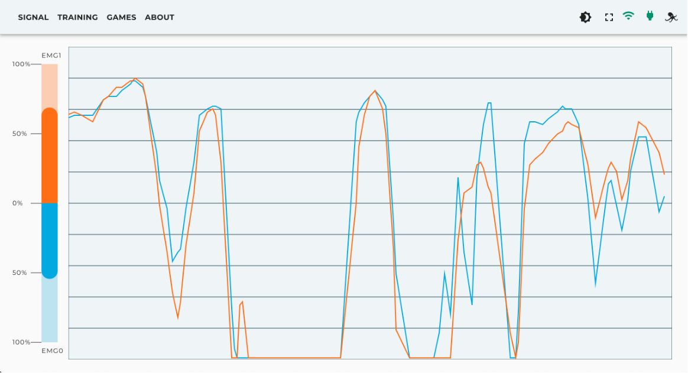

To use the MyoCoach application on a smartphone or a tablet, we recommend setting the device screen in horizontal (landscape) mode.

* :seven: - The shutdown and restart procedures are explained in the Settings section part. Push on the LED button (if equipped) for a straight shutdown.

### Main app bar
The main app bar allows user to navigate through all sections of the application and watch the system state. Depending on the client device screen width, the app bar can be displayed on the left or at the top of the screen :

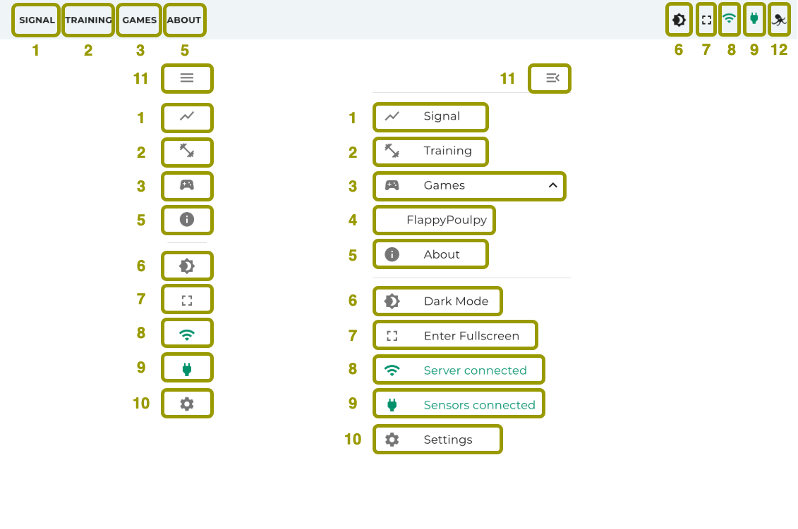

1. Go to Signal section (default section)
2. Go to Training section
3. Extend/reduce games list
4. Go to "FlappyPoulpy" game section
5. Go to About section
6. Enable/disable dark mode (default value depends of the client device OS settings)
7. Enable/disable fullscreen mode (not available on Safari web browser)
8. Server connection state
9. Sensors cardboard connection state
10. Go to Settings section
11. Extend/reduce main app bar
12. Show/hide the application menu

### Dashboard
The dashboard component display the EMG sensors measures :

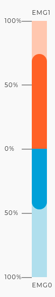

This component is visible on all sections.

### Signal section

The signal section is the application default section and displays EMG sensors measures plots :

### Training section

The training section offers several exercises to perform with EMG sensors. The first view invite the user to set up and launch a training session and/or create new custom trails.

#### Training session setup

The training session setup allows user to configure a session before start a training session.

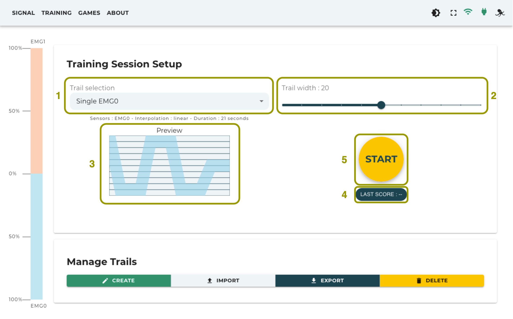

* :one: - Trail selection list contains all created trails from the manage trails section.
* :two: - Trail width slider sets the trail width from 10 to 30 to adjust the training session difficulty level.
* :three: - A graphical preview of the selected trail.
* :four: - The Last Score chip displays the previous session score.
* :five: - The Start button launches the session.

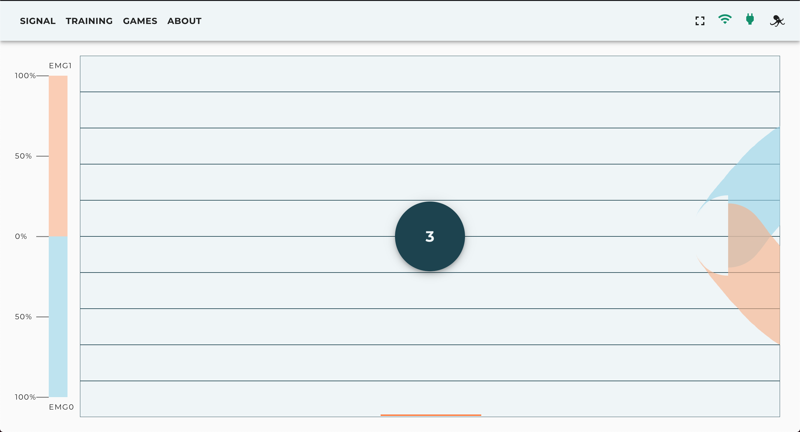

Before the session starts, a centered countdown appears to get ready. The session can be aborted with a click or tap on the countdown to back to the Training Session Setup.

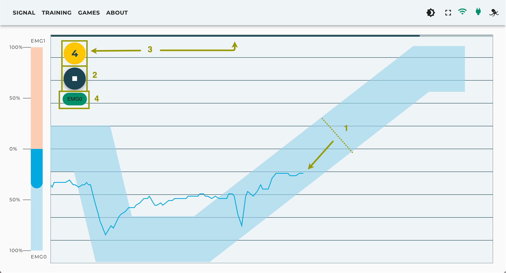

* The purpose of the exercise is to make EMG signal plots remain in the corresponding color path for the time of the session.
* The session can be aborted with a click or tap on the "Stop" button to get back to the Training Session Setup.
* The duration of the session is indicated by the countdown and the progressive bar.
* The color of these chips depends on whether the EMG signal plots are in or out of the path.

#### Manage trails

The manage trails section allows creating, importing, exporting and deleting trails :

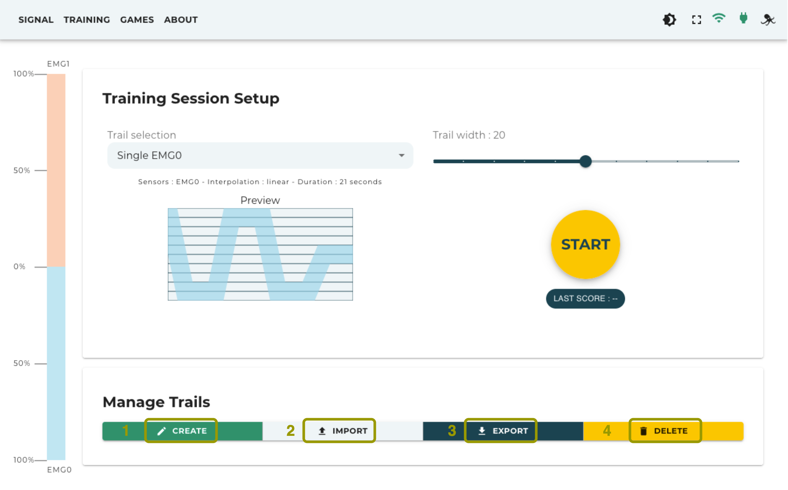

* Clicking the create button will open up a dialog box to create a new trail with the following specifications :

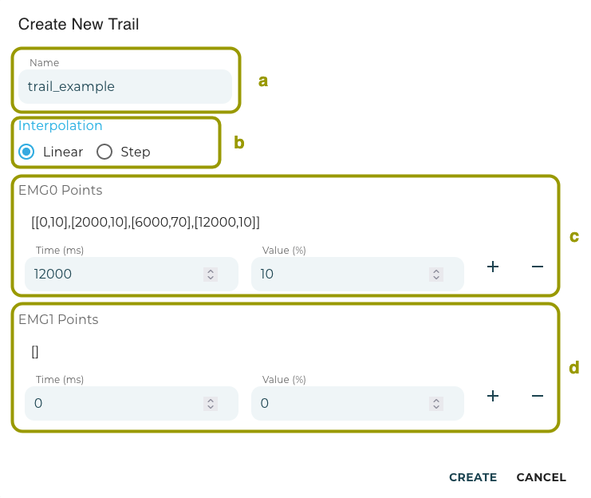

In MyoCoach application, a trail is a set of time/value points.
  * a - The trail name that will appear in the trail selection list and will also be the given file name in case of export.
  * b - The interpolation type defines how two following points will be linked in the trail.
  * c - The EMG0 Points section allows to append the set of time/value points. Use the "Plus" button to append, and the "Minus" to remove the last appended element.
  * d - The EMG1 Points section has the same functionalities as the section above. To use only one sensor, the other set must remain empty

* Clicking the export button will open up a dialog box with the trail list. Clicking the "Export" button will generate then download the selected trail in a .xlm file that can be uploaded to another MyoCoach device (using the import trail feature) :

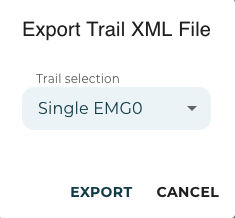

* Clicking the import button will open up a dialog box to upload .xml compatible file. The "Browse..." button allows user to choose the file to import on the client file system and then append it to the trail selection list :

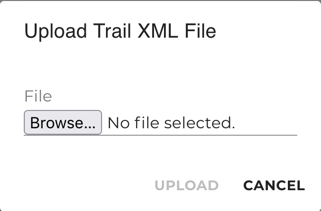

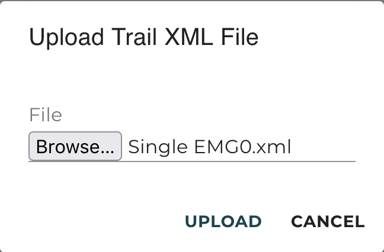

* Clicking the delete button will open up a dialog box with the trail list. The "Delete" button removes the selected trail :

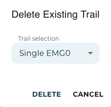

### Game section

The games available in MyoCoach are an entertaining alternative to practice EMG sensor control.

By default, one game is available on the MyoCoach : FlappyPoulpy

FlappyPoulpy is a FlappyBird-like game that uses EMG sensors as a controller.

* Once the game has finished loading, the following screen shows up :

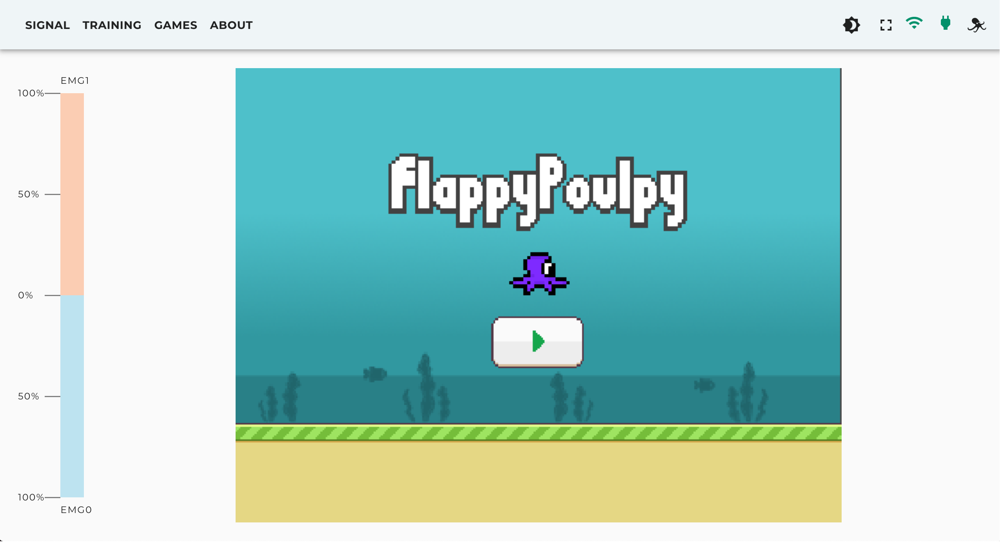

* Click or tap on the "Play" button to continue. Then a view shows up and explains how to use EMG sensors as a controller. Click, tap or exceed the 30% threshold with the EMG1 sensor (visible with the Dashboard component) to start the game :

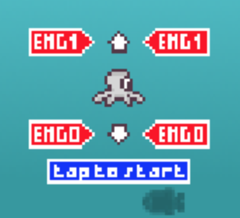

* Once the game started the objective is to go through the "gates" between two column and reach the best score possible. With each gate passed the score and speed of play increase :

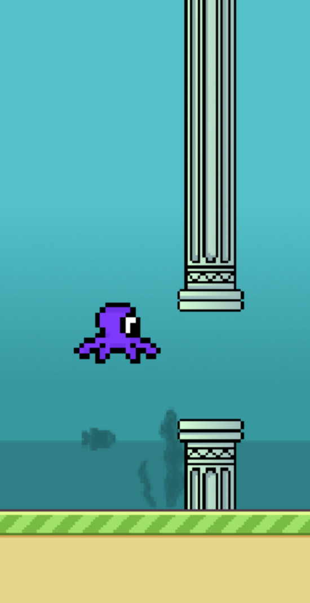

* In case of missing a passage the game over screen shows up displaying the score reached. Click or tap on the "Play" button or exceed the 30% threshold with the EMG1 sensor to start a new game :

### About section

The about section shows additional information about the MyoCoach project and Orthopus :

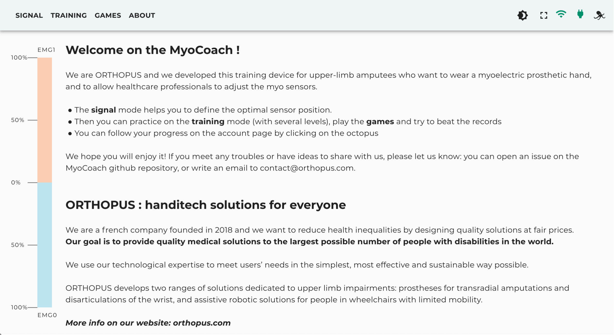

### Settings section

The settings section shows the MyoCoach general state and offers system actions :

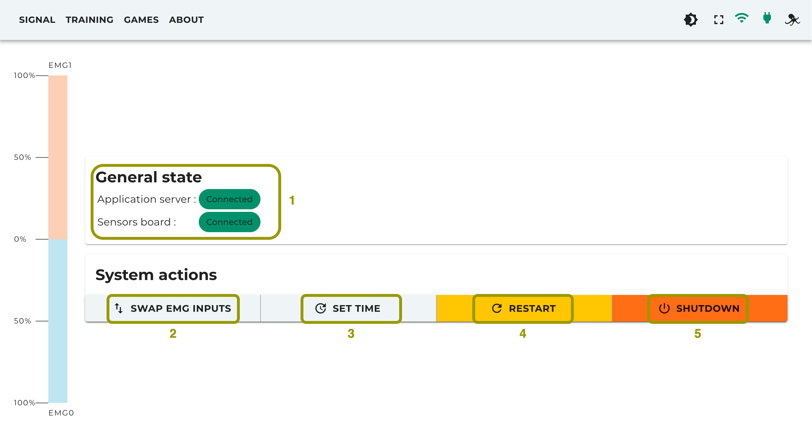

* :one: - Shows if sensors cardboard and server are connected or not.
* :two: - Swap EMG inputs : When clicked, the EMG sensors inputs are swapped immediately. An alert notifies the users of the action effect.
* :three: - Set time : When clicked, it immediately sets the MyoCoach clock (Raspberry Pi internal clock) to the client device time. An alert notifies the users of the action effect.
* :four: - Restart : When clicked, a dialog view shows up to ask for confirmation to restart the system. An alert notifies the users of the action effect. If equipped, the LED button will blink in yellow until system effectively restarts.
* :five: - Shutdown : When clicked, a dialog view shows up to ask for confirmation to shut the system down. An alert notifies the users of the action effect. If equipped, the LED button will blink in red until system effectively shuts down.

## Wi-Fi Access Point administration

The MyoCoach includes an access point application setup called RaspAP to enable Wi-Fi connection to the MyoCoach web application. RaspAP allows the Raspberry Pi to work as a router and also has a web application for its administration.

### Getting started

* :one: - Make sure the MyoCoach web application "Getting started" section has been followed before to start this section.
* :two: - Connect your device to the MyoCoach Wi-Fi network.
* :three: - To access the AP administration web application, open a web browser window and go to the following address : http://raspap.myocoach.lan
* :four: - An authentication request dialog shows up :

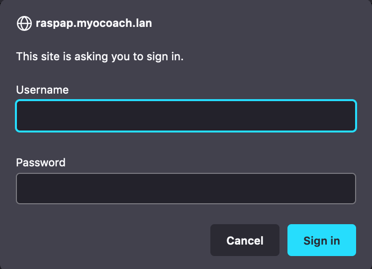

The credentials can be :
   * previously configured following the [server-programming-manual](./server-programming-manual.md)).
   * not configured, default value - Username = admin, Password = secret

* :five: - Once the RaspAP web application access granted, the following page shows up where all configurations are available :

* :six: - The complete RaspAP documentation is available at the following address : https://docs.raspap.com/